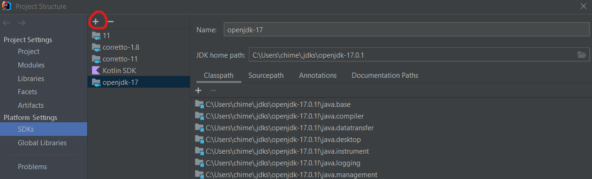
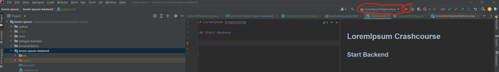
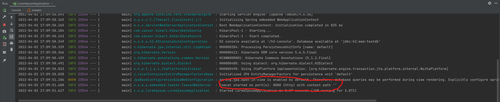
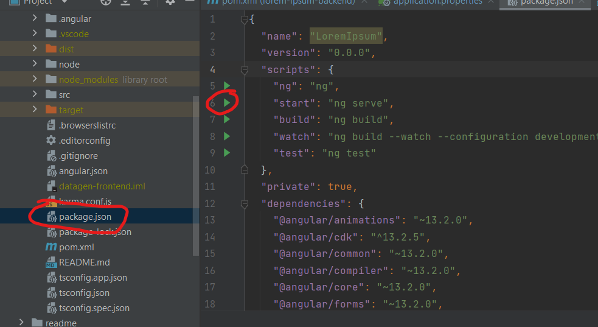
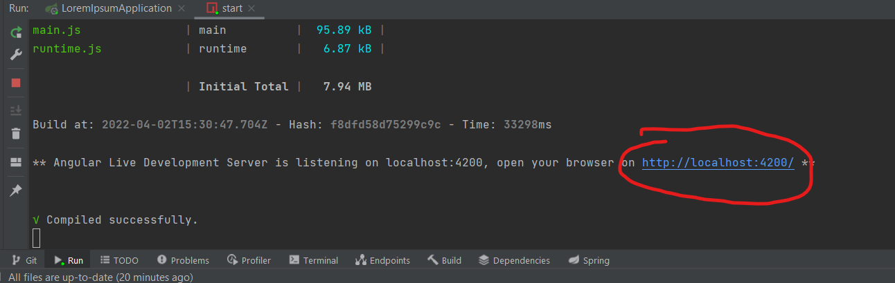

# LoremIpsum Crashcourse


## Setup

### Software
- IntelliJ IDEA Ultimate (Als Student gratis) [Herunterladen IntelliJ IDEA](https://www.jetbrains.com/de-de/idea/download/#section=windows)
- nodeJs & angular-cl [Setup bis und mit Step 3 durchführen](https://ccbill.com/kb/install-angular-on-windows)
- Browser (Chrome empfohlen)
### Setup IntelliJ IDEA
Download Projekt:
- File > New > Project from Version Control..
- URL -> https://github.com/Edelmetall/LoremIpsum.git

Setup JDK:
- File > Project Structure
- SDK's
- 
- Download JDK > 17 und ORACLE OpenJDK

## Start Backend


Hier kann man den Port sehen, auf welchem die Backend Services angeboten werden:


## Zugriff DB
- Link: http://localhost:8080/h2-console/
- JDBC URL: Jenachdem welche Source man in application.properties angegeben hat. (Default: jdbc:h2:mem:testdb)
- User Name: sa
- Password: 123


## Zugriff Swagger UI
- http://localhost:8080/swagger-ui/index.html

## Start Frontend
- 
- Browser -> 


## E-Mail Versand
Damit die Mails versendet werden, wird die Datei config.properties im Verzeichnis LoremIpsum\lorem-ipsum-backend\src\main\resources\email\ benötigt:

```
username = loremipsum.pm3@gmail.com
password = ***
mail.smtp.host = smtp.gmail.com
mail.smtp.port = 587
mail.smtp.auth = true
mail.smtp.starttls.enable = true
```

Version mit Passwort ist im Teams Kanal. Nicht mit Passwort commiten!